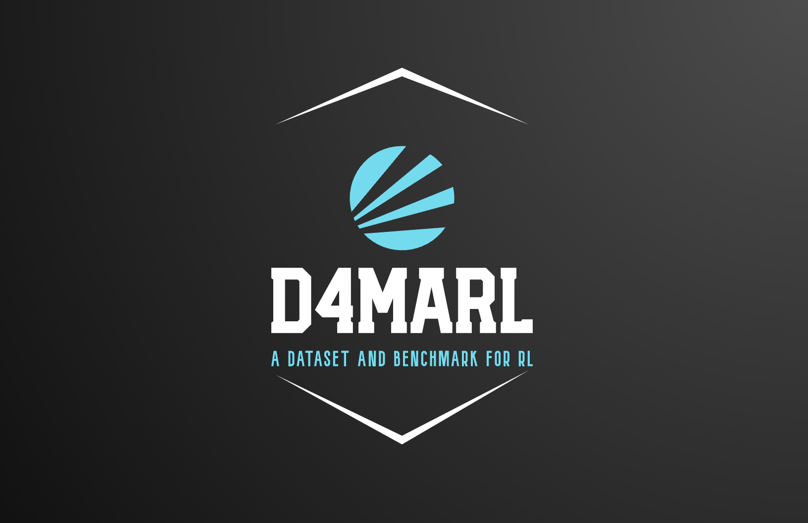

.. D4MARL documentation master file, created by
   sphinx-quickstart on Wed May 24 16:29:30 2023.
   You can adapt this file completely to your liking, but it should at least
   contain the root `toctree` directive.

.. Welcome to D4MARL's documentation!
.. ==================================

Introduction
============

Welcome To D4MARL Tutorial
----------------------------

Welcome to `D4MARL` in Offline MARL! 
D4MARL is a infrasturactual framework including a large-scale dataset and implementation of conventional offline MARL methods, and a webpage-based and easy-to-use toolkit for training and evaluation these approaches. Offline MARL aims to develop the algorithms for a promising starting-point with no or limited online interactions.

.. hint::

	**Offline MARL** attempt tackling the low-sample efficiency caused from the curse of dimensionality in the multi-agent field using the previous collected experiences. 

Why We Built This
-----------------

.. tab-set::

    .. tab-item:: Reason I
        :sync: key1

        .. card::
            :class-header: sd-bg-warning  sd-text-white sd-font-weight-bold
            :class-card: sd-outline-warning  sd-rounded-1
            :class-footer: sd-font-weight-bold

            Multi-agent Case
            ^^^^^^^^^^^^^
            Some datasets mainly focus on testing the ability of offline reinforcement learning algorithms in a single-agent setting. For example, in D4RL, singular state-action pairs and rewards are stored episode-wise as an offline dataset, which cannot be directly used to test the cooperation of multiple agents. In this benchmark, agents need to optimize the offline policy based on the assembled data. However, this ideal setting in the dataset, without constraining key components such as feasible actions and partially observable states, does not reflect the realistic problem setting, which often involves more than one agent.

    .. tab-item:: Reason II
        :sync: key2

        .. card::
            :class-header: sd-bg-warning sd-text-white sd-font-weight-bold
            :class-card: sd-outline-warning  sd-rounded-1
            :class-footer: sd-font-weight-bold

            Absence of unified, structured dataset
            ^^^^^^^^^^^^^^^^^^
            Existing offline reinforcement learning algorithms designed for multi-agent case, such as MADT and ICQ, are often tested on a single distribution or unstructured offline multi-agent data. Consequently, the diversity of the datasets they use is constrained by the collection methods, limiting their ability to be validated at scale on a unified benchmark.

    .. tab-item:: Reason III
        :sync: key2

        .. card::
            :class-header: sd-bg-warning sd-text-white sd-font-weight-bold
            :class-card: sd-outline-warning  sd-rounded-1
            :class-footer: sd-font-weight-bold

            Hard-to-find evaluation metrics
            ^^^^^^^^^^^^^^^^^^
            There is a variety of empirical metrics used to validate sample efficiency after pre-training on the dataset. For example, to overcome the value overestimation problem, conventional offline RL algorithms such as CQL, BEAR, and BCQ measure the training process with a static estimated value or returns. However, these metrics cannot be used to measure sample efficiency compared to popular online algorithms. To unify benchmark measurements in offline RL, systematic metrics are needed to benchmark existing methods on different practical tasks.

------

.. toctree::
    :hidden:
    :maxdepth: 3
    :caption: get started

    start/installation
    start/usage

.. toctree::
    :hidden:
    :maxdepth: 3
    :caption: introduction to environment

    smac/smac_env

Data Collection Principle
-----------------

.. grid:: 20 4 4 4 4 4
    :gutter: 1

    .. grid-item-card::
        :class-header: sd-bg-success sd-text-white sd-font-weight-bold
        :class-card: sd-outline-success  sd-rounded-1
        :columns: 12 5 5 4

        Large-scale Principle
        ^^^^^^^^^^^^^^^^^^^^^^^^
        Despite the current offline MARL methods showing promising results on several challenging tasks, the standard dataset should cover considerable task distribution enough to guarantee the effective validation of each algorithm.

    .. grid-item-card::
        :class-header: sd-bg-info sd-text-white sd-font-weight-bold
        :class-card: sd-outline-info  sd-rounded-1
        :columns: 12 5 5 4

        Publicly available principle
        ^^^^^^^^^^^^^^^^^^^^
        The offline dataset for MARL should be available with open access for each researcher to promote this topic.

    .. grid-item-card::
        :class-header: sd-bg-primary sd-text-white sd-font-weight-bold
        :class-card: sd-outline-primary  sd-rounded-1
        :columns: 12 5 5 4

        Feasible usage principle
        ^^^^^^^^^^^^^^^^^^^^^^^^^^
        There should be a standard interface for downloading and loading the data for the convenient algorithm design.

    .. grid-item-card::
        :class-header: sd-bg-primary sd-text-white sd-font-weight-bold
        :class-card: sd-outline-primary  sd-rounded-1
        :columns: 12 5 5 4

        Fairness principle
        ^^^^^^^^^^^^^^^^^^^^^^^^^^
	The offline dataset from diverse tasks should be accordingly collected along with the difficulty.

    .. grid-item-card::
        :class-header: sd-bg-primary sd-text-white sd-font-weight-bold
        :class-card: sd-outline-primary  sd-rounded-1
        :columns: 12 5 5 4

        Visualization principle
        ^^^^^^^^^^^^^^^^^^^^^^^^^^
	To help researchers tune their algorithms, the learning process and offline data distribution should be easily visualized in the proposed tools.

Indices and tables
==================

* :ref:`genindex`
* :ref:`modindex`
* :ref:`search`
